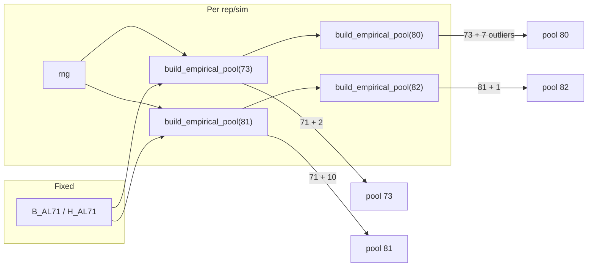

# Empirical Y: Fix 71 Fixed + Remainder Resampled

## Goal

- **71 digitized values** (B-Al and H-Al each have 71) appear exactly once in every simulated dataset; no resampling of those.
- **Remainder** (2 for n=73, 10 for n=81, plus 7 outliers for n=80, 1 for n=82) is drawn anew each n_sim/n_rep via the caller’s RNG.
- **Consistency:** 73 ⊂ 80 and 81 ⊂ 82: when building n=80, use the same “73” (71+2) then append 7 outliers; when building n=82, use the same “81” (71+10) then append 1 outlier.
- **Assignment:** The n values (fixed 71 + remainder) are assigned to the n positions by rank-mixing only (no drawing with replacement from the pool).

## Current behavior (to change)

- [get_pool(n)](data_generator.py) builds one cached pool per n with a fixed seed: e.g. 73 = B_AL71 + 2 (seed 42), 80 = get_pool(73) + 7 outliers. Same pool reused for all reps.
- [_raw_rank_mix](data_generator.py) and [_raw_rank_mix_batch](data_generator.py) use `rng.choice(pool, size=n, replace=True)`, so the 71 can appear 0/1/2/… times per dataset.

## Design

- **Calibration** continues to use a single reference pool per n (current `get_pool(n)` with fixed seed), so calibration remains deterministic and cached. Use that pool in calibration with **no replacement** (assign pool values by rank-mix) so calibration matches new data behavior.
- **Data generation** uses a new helper that builds the pool from 71 + remainder using the **caller’s rng**, and rank-mix **assigns** those n values to positions (no replacement).

## Implementation

### 1. Add `build_empirical_pool(n, rng)` in [data_generator.py](data_generator.py)

- **Location:** Near `get_pool`, same “Empirical pool construction” section.
- **Logic:**
  - `n == 73`: `np.concatenate([B_AL71, rng.choice(B_AL71, size=2, replace=True)])`
  - `n == 80`: `np.concatenate([build_empirical_pool(73, rng), generate_b_al_outliers(n_missing=5, rng=rng)])` so 73 ⊂ 80.
  - `n == 81`: `np.concatenate([H_AL71, rng.choice(H_AL71, size=10, replace=True)])`
  - `n == 82`: `np.append(build_empirical_pool(81, rng), H_AL_OUTLIER)` so 81 ⊂ 82.
- No caching; each call uses `rng` and may advance it.
- Reuse existing `generate_b_al_outliers(..., rng=rng)` (already takes `rng`).

### 2. Restrict `get_pool(n)` to calibration-only use

- Keep [get_pool](data_generator.py) as-is (cached, fixed seed) for **calibration only**: [calibrate_rho_empirical](data_generator.py) and `_mean_rho_empirical` / `_bisect_for_probe_empirical` continue to receive `pool` from `get_pool(n)`.
- In the docstring, state that `get_pool` is for calibration; data generation should use `build_empirical_pool(n, rng)`.

### 3. Use “assign n values, no replacement” in rank-mix for empirical

- **_raw_rank_mix** ([data_generator.py](data_generator.py) ~414–418): For `marginal == "empirical"`, require `len(pool) == n`. Replace `y_values = rng.choice(pool, size=n, replace=True)` with: sort the pool and assign by mixed order, e.g. `y_values = np.sort(pool)` then `y_final[np.argsort(mixed)] = y_values`. No RNG for y-values here (pool is already the n values for this rep).
- **_raw_rank_mix_batch** ([data_generator.py](data_generator.py) ~968–971): For empirical, require `pool.ndim == 2` and `pool.shape == (n_sims, n)`; raise a clear error if a 1D pool is passed: `"For empirical marginal, pool must be 2D with shape (n_sims, n), got shape {pool.shape}"`. Replace `y_values = rng.choice(pool, size=(n_sims, n), replace=True)` with `y_values = np.sort(pool, axis=1)` and keep the existing assignment `y_final[rows, order] = y_values`.

### 4. Calibration: empirical pool used without replacement

- [_mean_rho_empirical](data_generator.py) (~760): Pool is length `nn`. Replace `y_vals = cal_rng.choice(pool, size=nn, replace=True)` with: use pool as the nn values, sort, assign by mixed (same as data path). So `y_vals = np.sort(pool)` and `y_final[np.argsort(mixed)] = y_vals`. Shuffle of x and noise_ranks still use `cal_rng`; only the y assignment changes to no-replacement from pool. This keeps calibration aligned with the new data-generating model.

### 5. Single-rep generator: build pool from rng, do not use get_pool for data

- [generate_y_empirical](data_generator.py): Stop using `get_pool(len(x))`. Compute `pool = build_empirical_pool(len(x), rng)`, then call `_raw_rank_mix(..., marginal="empirical", pool=pool)`. Signature can stay; remove any doc reference to get_pool for data.

### 6. Batch generator: build one pool per rep, pass (n_reps, n) pool array

- [generate_y_empirical_batch](data_generator.py): Drop the `pool=None` path that called `get_pool(x_batch.shape[1])`. For `(n_reps, n) = x_batch.shape`, build `pool_batch = np.array([build_empirical_pool(n, rng) for _ in range(n_reps)])`, then call `_raw_rank_mix_batch(..., marginal="empirical", pool=pool_batch)`. Remove the `pool` parameter from the public API (callers no longer pass pool for data). **This is an intentional breaking change.** The only callers are `confidence_interval_calculator.py`, `power_simulation.py`, and tests — all updated in §7. No external callers are known.
- **Performance:** The Python loop `[build_empirical_pool(n, rng) for _ in range(n_reps)]` is acceptable for the initial implementation. If profiling shows it as a hotspot for large `n_reps`, vectorizing the remainder draws (or using Numba) can be a later optimization.

### 7. Call sites: pass pool only for calibration

- [confidence_interval_calculator.py](confidence_interval_calculator.py): Keep `pool = get_pool(n)` and pass it only to `calibrate_rho_empirical(...)`. Remove `pool=pool` from all `generate_y_empirical` and `generate_y_empirical_batch` calls (lines ~157, 285–287, 326–328, 354–355).
- [power_simulation.py](power_simulation.py): Keep `pool = get_pool(n)` only for `calibrate_rho_empirical(...)`. Remove `pool=pool` from `generate_y_empirical_batch` and `generate_y_empirical` (lines ~118–120, 138).
- [tests/test_calibration_accuracy.py](tests/test_calibration_accuracy.py): Keep `get_pool(n)` only where needed for calibration; ensure `generate_y_empirical` is called with `rng` and no pool (it will build pool via `build_empirical_pool` internally).

### 8. Tests and docs

- Add or extend a test that (a) generates several datasets with the empirical generator and the same seed, (b) checks that each dataset’s y contains exactly the 71 digitized values once (and the remainder matches 2 or 10 + outliers as appropriate). Optionally check pool structure for 73 ⊂ 80: create two RNGs with the **same seed** (`rng73 = np.random.default_rng(seed)` and `rng80 = np.random.default_rng(seed)`), build `pool_73 = build_empirical_pool(73, rng73)` and `pool_80 = build_empirical_pool(80, rng80)`, and require `pool_80[:73] == pool_73` (since `build_empirical_pool(80, ...)` internally calls `build_empirical_pool(73, ...)` first, the same seed produces the same 73 prefix). New script e.g. `tests/test_empirical_generator.py`; register in the regression runner.
- **Extend regression test 7.3** ([tests/test_empirical_invalid_n.py](tests/test_empirical_invalid_n.py)): **keep** the existing `get_pool(n)` invalid-n checks (calibration API), and **add** `build_empirical_pool(n, rng)` invalid-n checks (data-generation API). Both should raise `ValueError` for unsupported n. This covers both APIs after the fix.
- Update [README.md](README.md) or docstrings where the empirical generator is described, to state that the 71 digitized points (B-Al and H-Al each have 71) are fixed and only the remainder is resampled per sim/rep, and that 73 ⊂ 80 and 81 ⊂ 82.

## Summary of file changes

| File                                                                   | Changes                                                                                                                                                                                                                                                                                                                                                                   |
| ---------------------------------------------------------------------- | ------------------------------------------------------------------------------------------------------------------------------------------------------------------------------------------------------------------------------------------------------------------------------------------------------------------------------------------------------------------------- |
| [data_generator.py](data_generator.py)                                 | Add `build_empirical_pool(n, rng)`; doc `get_pool` as calibration-only; in `_raw_rank_mix` / `_raw_rank_mix_batch` use empirical pool as n values (sort + assign, no replacement); in `_mean_rho_empirical` use pool without replacement; `generate_y_empirical` / `generate_y_empirical_batch` build pool via `build_empirical_pool`, drop pool from batch API for data. |
| [confidence_interval_calculator.py](confidence_interval_calculator.py) | Use `get_pool(n)` only for calibration; remove `pool=` from all empirical generator calls.                                                                                                                                                                                                                                                                                |
| [power_simulation.py](power_simulation.py)                             | Use `get_pool(n)` only for calibration; remove `pool=` from empirical generator calls.                                                                                                                                                                                                                                                                                    |
| [tests/test_calibration_accuracy.py](tests/test_calibration_accuracy.py) | Use `get_pool` only for calibration if needed; rely on generators building their own pool.                                                                                                                                                                                                                                                                                |
| [tests/test_empirical_invalid_n.py](tests/test_empirical_invalid_n.py) | Extend regression test 7.3: keep existing `get_pool(n)` invalid-n checks, add `build_empirical_pool(n, rng)` invalid-n checks (both APIs covered). Add new test script (e.g. `test_empirical_generator.py`) for 71-fixed-once and optionally 73⊂80; register in runner. See [regression plan](plans/regression_tests_and_renames_plan.md).                                  |
| README / docstrings                                                    | Clarify empirical design (71 fixed, remainder resampled, 73⊂80, 81⊂82).                                                                                                                                                                                                                                                                                                   |

## Edge cases

- **Reproducibility:** With the same `seed`, `data_rng` is identical, so the sequence of “remainder” draws is fixed; only the pool construction and assignment change, so results are reproducible but will differ from current (pre-fix, resampling-with-replacement) behavior.
- **Calibration outputs change:** Calibration remains deterministic and cached (uses `get_pool(n)` with fixed seed), but switching from `replace=True` to no-replacement assignment will produce different calibrated rho values than the current implementation. All downstream power/CI results that depend on empirical calibration will change accordingly.
- **n not in {73,80,81,82}:** `build_empirical_pool` should raise the same ValueError as `get_pool` for unsupported n.

